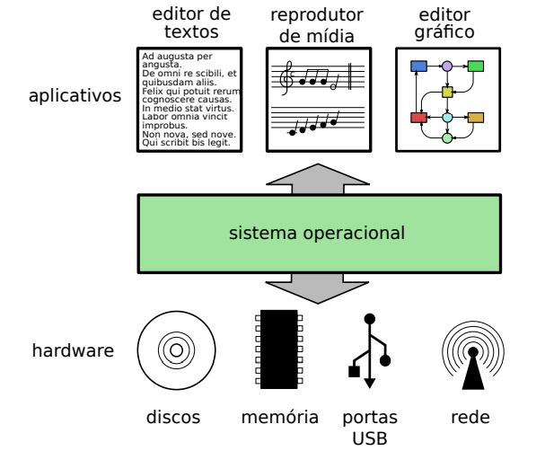

<!-- $theme: gaia -->

# Administração de ==Sistemas Operacionais==

### Aula 1 && 2

###### Antônio Sérgio de Sousa Vieira
###### Curso Técnico Integrado em Informática
###### IFCE campus Itapipoca
### Julho de 2019
###### :email: sergio.vieira@ifce.edu.br

---
# Considerações Iniciais
- Disciplina de 40 horas
	- **20 horas** de teoria
	- **20 horas** de prática

<!--
- Notas
	- **N1.1** - Trabalho - **N1.2** - Prova
	- **N2.1** - Trabalho - **N2.2** - Prova
- Média Aritmética
	- ==Média acima de 6 passa direto==
-->
---
# Considerações Iniciais
- O que será aprendido na disciplina
	- Conceitos sobre os Sistemas Operacionais
	- Windows
	- Linux

---
# Considerações Iniciais
- Horário de Atendimento ao Estudante

# `Quarta: 14:45 - 18:00`

---
# Objetivos da Aula
- Conceituar o Sistema Operacional
- Objetivos do Sistema Operacional
- Abstração de Recursos
- Funcionalidades
- Gerência de Recursos, proteção, arquivos

---
# Conceitos Fundamentais de Sistemas Operacionais
<!-- page_number: true -->
- **Sistema Operacional** é um programa ou um conjunto de programas cuja função é gerenciar os ==recursos do sistema== (hardware).
- Ele vai ser o responsável por definir qual programa receberá a atenção do processador, gerenciar memória, criar um sistema de arquivos, além de fornecer uma interface entre o computador e o usuário.

---
# Conceitos Fundamentais de Sistemas Operacionais

- Ele também fornece uma base para os programas aplicativos e atua como intermediário entre o usuário e o hardware do computador
- **Sistema Operacional** é o primeiro programa que a máquina executa no momento em que é ligada (==bootstrapping==) e, a partir de então, não deixa de funcionar até que o computador seja desligado.

---
# Conceitos Fundamentais de Sistemas Operacionais
- O sistema operacional reveza sua execução com a de outros programas, como se estivesse vigiando, controlando e orquestrando todo o processo computacional.

---
# Conceitos Fundamentais de Sistemas Operacionais
- alguns sistemas operacionais são projetados para serem **convenientes**, outros para serem **eficientes**, e outros para atenderem a alguma combinação de ambos os aspectos.

---
# Conceitos Fundamentais de Sistemas Operacionais
- Objetivos de um Sistema Operacional
	- Existe uma grande distância entre os circuitos eletrônicos e dispositivos de hardware e os programas aplicativos em software.

---
# Conceitos Fundamentais de Sistemas Operacionais
- Objetivos de um Sistema Operacional
	- Os circuitos são complexos, acessados através de interfaces de baixo nível (geralmente usando as **portas de entrada/saída do processador**) e muitas vezes suas características e seu comportamento **dependem da tecnologia usada em sua construção**.

---
# Conceitos Fundamentais de Sistemas Operacionais
- Objetivos de um Sistema Operacional
	- Exemplo:
		- A forma de acesso de baixo nível a discos rígidos é diferente da forma de acessar um leitor de CD.

---
# Conceitos Fundamentais de Sistemas Operacionais
- Portanto, é desejável oferecer aos programas aplicativos uma **forma de acesso homogênea aos dispositivos físicos**, que permita abstrair sua complexidade e as diferenças tecnológicas entre eles.

---
# Conceitos Fundamentais de Sistemas Operacionais
- O sistema operacional é uma camada de **software** que opera entre o **hardware** e os programas aplicativos voltados ao **usuário final**.

---
# Conceitos Fundamentais de Sistemas Operacionais

---
# Teste seus conhecimentos!!!
<!-- *template: invert -->

---
# Conceitos Fundamentais de Sistemas Operacionais
- **Abstração de Recursos**
	- Acessar os recursos de **hardware** de um sistema de computação pode ser uma tarefa complexa, devido às características específicas de cada dispositivo

---
# Conceitos Fundamentais de Sistemas Operacionais
- **Abstração de Recursos**: a sequência a seguir apresenta os principais passos envolvidos na abertura de um arquivo (operação **open**) em um disco:

1. verificar se os parâmetros informados estão corretos (nome do arquivo)
2. verificar se o disco está disponível;
3. ligar o motor do disco e aguardar atingir a velocidade de rotação correta;

---
# Conceitos Fundamentais de Sistemas Operacionais
- **Abstração de Recursos**
4. ler a tabela de diretório e localizar o arquivo ou subdiretório desejado;
5. ler o bloco inicial do arquivo e depositá-lo em um buffer de memória

---
# Conceitos Fundamentais de Sistemas Operacionais
- **Abstração de Recursos**
	- O sistema operacional deve definir interfaces abstratas (**maneiras fáceis**) para os recursos do hardware, visando atender os seguintes objetivos:

---
# Conceitos Fundamentais de Sistemas Operacionais
- **Abstração de Recursos**
	- Prover interfaces de acesso aos dispositivos, mais simples de usar que as interfaces de baixo nível, para simplificar a construção de programas aplicativos.

---
# Conceitos Fundamentais de Sistemas Operacionais
- **Abstração de Recursos**
	- Tornar os aplicativos independentes do hardware.
	- O código de um editor de textos não deve ser dependente da tecnologia de discos utilizada no sistema.

---
# Conceitos Fundamentais de Sistemas Operacionais
- **Abstração de Recursos**
	- Definir interfaces de acesso **homogêneas** (iguais) para dispositivos com tecnologias diferetes (HD e o SSD)

---
# Conceitos Fundamentais de Sistemas Operacionais
- **Abstração de Recursos**
	- Acessar os recursos de hardware de um sistema de computação pode ser umatarefa complexa, devido às características específicas de cada dispositivo

---
# Teste seus conhecimentos!!!
<!-- *template: invert -->

---
# Conceitos Fundamentais de Sistemas Operacionais
- **Gerência de Recursos**
	- Os programas aplicativos **usam o hardware para atingir seus objetivos**: ==ler== e ==armazenar dados==, ==editar== e ==imprimir== documentos, ==navegar== na Internet, ==tocar música==, etc

---
# Conceitos Fundamentais de Sistemas Operacionais
- **Gerência de Recursos**
	-  Em um sistema com várias **atividades simultâneas**, podem surgir **conflitos no uso do hardware**, quando dois ou mais aplicativos precisam dos mesmos recursos para poder executar.

---
# Conceitos Fundamentais de Sistemas Operacionais
# `Cabe ao sistema operacional definir políticas para gerenciar o uso dos recursos de hardware pelos aplicativos, e resolver eventuais disputas e conflitos`

---
# Conceitos Fundamentais de Sistemas Operacionais
- Um sistema operacional visa **abstrair o acesso** e **gerenciar os recursos de hardware**, provendo aos aplicativos um ==ambiente de execução abstrato==, no qual o ==acesso aos recursos se faz através de interfaces simples==, independentes das características e detalhes de baixo nível, e no qual os conflitos no uso do hardware são minimizados.

---
# Teste seus conhecimentos!!!
<!-- *template: invert -->

---
# Introdução a Sistemas Operacionais
- **Funcionalidades**
	- Para cumprir seus objetivos de abstração e gerência, o sistema operacional deve atuar em várias frentes
	
---
# Introdução a Sistemas Operacionais
- **Funcionalidades**
	- As principais funcionalidades implementadas por um sistema operacional
típico são:

---
# Introdução a Sistemas Operacionais

1. **Gerência do processador**: também conhecida como ==gerência de processos==, de ==tarefas== ou de ==atividades==.

Visa distribuir a **capacidade de processamento de forma justa** entre as aplicações, ==evitando== que uma **aplicação monopolize esse recurso** e respeitando as prioridades definidas pelos usuários.

---
# Introdução a Sistemas Operacionais
2. **Gerência de memória**: tem como objetivo fornecer a cada aplicação uma área de memória própria, independente e isolada das demais aplicações e inclusive do sistema operacional.

O **isolamento das áreas de memória** das aplicações melhora a estabilidade e ==segurança do sistema== como um todo, pois impede aplicações com erros (ou **aplicações maliciosas**) de interferir no funcionamento das demais aplicações.

---
# Introdução a Sistemas Operacionais
3. **Gerência de dispositivos**: cada periférico do computador possui suas particularidades

Assim, o procedimento de interação com uma **placa de rede** é completamente diferente da interação com um **disco rígido**.

---
# Introdução a Sistemas Operacionais
- **Gerência de arquivos**: esta funcionalidade é construída sobre a gerência de dispositivos e visa criar arquivos e diretórios, definindo sua interface de acesso e as regras para seu uso.

---
# Introdução a Sistemas Operacionais
- **Gerência de proteção**: com computadores conectados em rede e compartilhados por vários usuários, é importante definir claramente os recursos que cada usuário pode acessar, as formas de acesso permitidas (leitura, escrita, etc.) e garantir que essas definições sejam cumpridas. 

<!--

# Introdução a Sistemas Operacionais
- Categorias

# Introdução a Sistemas Operacionais
- Histórico
-->
