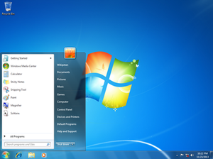
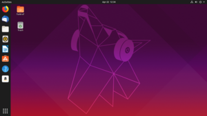
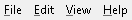
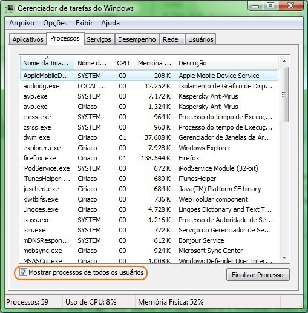
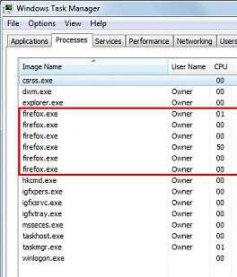

<!-- $theme: gaia -->

# Administração de ==Sistemas Operacionais==
      
### Aula 3 && 4

###### Antônio Sérgio de Sousa Vieira
###### Curso Técnico Integrado em Informática
###### IFCE campus Itapipoca
### Julho de 2019
###### :email: sergio.vieira@ifce.edu.br

---
# Objetivos da Aula
- Diferenciar interface gráfica de interface de linha de comando
- Conceitos básicos do Windows 7
- Gerenciador de tarefas
	- Aplicativos
	- Processos
	- Serviços
	- Primeiro Plano e Segundo Plano

---
# Conceitos Iniciais
- GUI (Graphic User Interface)
# `Interface Gráfica de Usuário`
- CLI (Command Line Interface)
# `Interface de Linha de Comando`
<!-- page_number: true -->

---
# Conceitos Iniciais
- Windows

---
# Conceitos Iniciais
- Linux

---
# Windows 7
-  O que é o botão Iniciar?
	-  É o ponto de partida para acessar qualquer programa ou aplicativo
	-  Pode ser acessado a partir das teclas CTRL + ESC
	-  Ou através do botão (windows)

---
# Windows 7
-  **Barra de Tarefas**
	- É a barra horizontal localizada na parte inferior da tela
	- Lá pode-se encontrar atalhos para os aplicativos, o relógio, o ícone de rede, os aplicativos abertos etc

---
# Windows 7
- Para acessar a **barra de tarefas**, tecle **CTRL ESC**, em seguida **ESC** para fechar o menu Iniciar. 
- Tecle **TAB** uma vez para ir para o primeiro item.
- Use seta para direita ou para esquerda para navegar pelas opções.
- Tecle **ENTER** para selecionar a opção desejada.

---
# Windows 7

- Tecle **TAB** mais uma vez para ir para o lado direito, ou seja, próximo aos itens onde o ícone do volume esta localizado.
- As vezes, a tecla espaço pode ser utilizado para ativar/desativar algumas opções

---
# Windows 7
- ==Fixando um ícone de programa ou aplicativo== 
- Tecle **CTRL + ESC**, seta para baixo até Todos os Programas, tecle **ENTER**, desça até Acessórios, tecle **ENTER**, desça com a seta no aplicativo desejado (neste caso, o **WordPad**) e tecle **SHIFT F10** para acionar o botão direito do mouse. 
- No menu que se abre, desça até a opção “Fixar na Barra de Tarefas” e tecle ENTER. 
- Para confirmar, basta ir até o local em que foi fixado (Barra de Tarefas) e verificar se foi adicionado o aplicativo. 

---
# Windows 7
- ==Desafixando um ícone de programa ou aplicativo== 
- Tecle **CTRL ESC**, seta para baixo até o programa a ser desafixado (exemplo: **WordPad**), tecle **SHIFT F10** para acionar o botão direito do mouse, seta para baixo até a opção “Desafixar do Menu Iniciar” e tecle **ENTER** para finalizar.

---
# Teste sus conhecimentos
<!-- *template: invert -->
**Realize utilizando apenas o teclado as seguintes tarefas.**

1. Fixe na barra de tarefas um atalho para a calculadora e o bloco de nota
2. Abra o Windows Explorer
3. Desafixe o bloco de notas da barra de tarefas
4. Desative o volume

---
# Windows 7
- ==Conhecendo a Área de Trabalho==
	- É o espaço que temos para trabalhar no Windows. 
	- É a tela exibida quando se liga o computador e o Windows é carregado.

---
# Windows 7
- A **Área de Trabalho** funciona como se fosse uma mesa e, da mesma forma que se pode ter sobre a mesa suas ferramentas de trabalho (um relógio, uma calculadora, uma agenda, pastas, documentos, dentre outras coisas), também pode-se ter vários aplicativos abertos ao mesmo tempo.
- Além das janelas dos aplicativos, a **Área de Trabalho** contém ==pequenos desenhos (ícones)== que representam **atalhos para determinadas aplicações** (tais como: lixeira, atalhos para aplicativos, Internet Explorer etc).

---
# Como funciona o Windows?
- **O que é uma Janela**?
	- Sempre que você abre um programa, um arquivo ou uma pasta, ele aparece na tela em uma moldura (área retangular) chamada **Janela**.
	- O **Windows 7** permite executar vários aplicativos simultaneamente, ou seja, ter várias janelas abertas ao mesmo tempo. 
	- **O limite está na memória do computador**, ou seja, quanto mais memória, mais janelas ele poderá abrir.

---
# Como funciona o Windows?
- Para mudar de um aplicativo para outro, devemos pressionar simultaneamente as teclas **ALT TAB** e soltá-las no momento em que posicionarmos no aplicativo desejado. 
- Esse atalho também possibilita a recuperação do foco de uma janela que se encontra inativa.
- Para fechar uma janela pode-se utilizar o atalho **ALT F4**

---
# Como funciona o Windows?

- **Minimizar** : *Esconde* a janela na Barra de tarefa - ==Atalho==  :arrow_down:
- **Maximizar** : Aumenta o tamanho janela para que ela possa preencher completamente a área de trabalho - ==Atalho==  :arrow_up:
- **Fechar** : Fecha a janela - ==Atalho== **ALT F4**
- Utilize o atalho **logotipo do Windows** juntamente com a tecla **Home** para fechar todas as janelas abertas, exceto a ativa.

---
# Como funciona o Windows?
- **Alinhar janela a esquerda** - ==Atalho==  :arrow_left:
- **Alinhar janela a direita** - ==Atalho==  :arrow_right:

---
# Como funciona o Windows?
- **Menu**
	- Um menu é composto por uma lista de itens de menu. 
	- Alguns itens de menu podem acessar outros submenus, os quais apresentam uma lista adicional de comandos. 

---
# Como funciona o Windows?
- **Menu**
	- Para selecionar um item do menu pressione e segure a tecla **ALT**, com isto aparecerá um _ abaixo de alguma letra de cada item do menu.

- Portanto, para selecionar o item **FILE**, mantenha o botão **ALT** pressionado e aperte a letra **F**.

---
# Gerenciador de Tarefas
- Através do **Gerenciador de Tarefas** você pode controlar
	- ==Aplicativos==
	- ==Processos==
	- ==Serviços==
- Você também pode encerrar programas problemáticos
- Verificar o desempenho do sistema
	- uso do ==CPU==, ==Memória== etc

---
# Gerenciador de Tarefas
- Para acessá-lo tecle **CTRL SHIFT ESC** ao mesmo tempo

---
# Gerenciador de tarefas
- ==Aplicativo==
	- É um programa que você interage através da área de trabalho
	- Office, Firefox, Spotify etc

---
# Gerenciador de Tarefas
- ==Processos==
	- E uma instância de um **executável** (.exe) - *Programa do S.O*
	- Um dado aplicativo pode ter ==vários processos rodando simultâneamente==
	- Exemplo:
		- No **Firefox**, cada processo pode ser responsável por uma página diferente
		- No **Google Chrome** o funcionamento é semelhante

---
# Gerenciador de Tarefas

---
# Gerenciador de Tarefas
- ==Serviços==
	- É um processo que funciona em **background**
		- Background (**Segundo plano**)
			- São processos em que ==**não** há interação com o usuário==
		- Foreground (**Primeiro plano**)
			- São processos ==sujeitos à interação direta dos usuários==
	- No Windows, geralmente são instâncias de ==**svchost.exe**== (Windows Services Host Process)

---
# Gerenciador de Tarefas
###### Exemplos de serviços do windows
| Serviço | Descrição |
| - | - |
| AdobeLM Service | serviço que verifica se os produtos da Adobe instalados possuem as devidas licenças. |
| Atualizações automáticas | monitora atualizações do Windows. |
| Gerenciamento de aplicativo | processa solicitações de instalação e remoção dos programas. |

---
# Teste seus conhecimentos!!!
<!-- *template: invert -->

---
# Navegação básica do S.O
- Navegando entre diretórios (pastas)
- Informações dos arquivos
- Apagando arquivos e pastas

---
# Manipulação de Arquivos e Textos
- Procurando arquivos através dos diretórios
- Buscando um arquivo específico
- Copiando e colando
- Encadeamento de comandos

---
# Diretórios (Pastas)
- Os arquivos dentro do S.O estão localizados em diretórios e subdiretórios
- Caminho (Path)
	- Localização específica de um arquivo
		- No Windows um caminho parece com isto:

# `C:\Usuários\Aluno\Downloads`

---
# Sistema de Arquivos (filesystem)
- Para cada disco instalado no computador existe um sistema de arquivos
- Um sistema de arquivos é responsável por rastrear todos os arquivos armazenados no disco
- No Windows, para cada sistema de arquivo é atribuída uma letra, da seguinte forma:

# `C:, ou D:, ou X:`

---
# Sistema de Arquivos (filesystem)
- O diretório raiz do disco ==C:== deve ser escrito como:
# `C:\`
- Assim como o diretório raiz do disco X: deve ser escrito como:
# `X:\`

---
# Sistema de Arquivos (filesystem)
- No Windows, subdiretórios são separados com
## `\ (Barra invertida - backslash)`
- Já no Linux, subdiretórios são separados com
## `/ (Barra - forward slash)`

---
# Exercício
- Localize através do Windows Explorer o diretório
# `C:\Usuários\Alunos\Downloads`
<!-- Exibir as propriedades do arquivo -->

---

